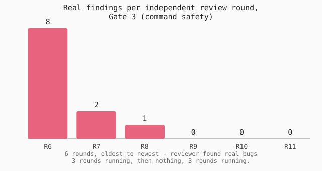

# jev-seatbelts

<!-- markdownlint-disable-next-line MD034 -->
https://github.com/user-attachments/assets/3e3f327d-c464-4319-80c1-6e35ab1306a7

Your AI coding agent is quick, confident, and every now and then about
as careful as a wombat behind the wheel of a stolen ute. It'll happily
install a package that doesn't exist, `rm` something it can't get
back, or tell you "all done, tests pass" without running a single
test. jev-seatbelts is the seatbelt it didn't know it needed.

## What it actually does (no jargon, promise)

Seven checkpoints sit quietly in the background while an AI coding
agent works, and only speak up when something looks dodgy:

1. **Before it plans** - does the plan actually hold together, or is
   it flying blind?
2. **Before it installs anything** - is that package real, or a typo
   that only looks real?
3. **Before it runs a risky command** - is this about to delete,
   force-push, or drop something you can't get back?
4. **Before it commits** - is a password or a secret key about to go
   into the commit?
5. **When it's stuck debugging** - is it guessing, or does it
   actually know what's wrong?
6. **After it writes code** - did it just paper over the problem
   instead of fixing it?
7. **Before it says "done"** - did it actually check, or is it just
   telling you what you want to hear?

Most of these checks are instant and free - no AI needed, just a
sharp, boring rule (a lookup, a pattern match, a hard line that never
moves). Only the genuinely tricky calls get sent to a small, cheap AI
model ([Jev](https://typesafe.ai)) built to answer exactly one narrow
question, fast, for a fraction of a cent. Cheap and boring first,
smart and paid only when it's actually earned.

## The numbers, for the sceptics

This wasn't vibes-coded and shipped on a Friday arvo. Every figure
below comes straight off this repository's own test results and
review history - nothing here is a marketing number.

| What was checked | Result |
| --- | --- |
| Automated test scenarios, all 7 gates combined | 163 / 163 passing (100%) |
| Independent adversarial review rounds on the highest-risk gate (command safety) | 11 rounds, converging to zero findings |
| Findings from the most recent independent review, confirmed real and fixed before merge | 5 of 6 flagged issues |
| Commits from first line to today, no single mega-commit hiding the work | 98 |
| Gate still awaiting a real production track record before its threshold is trusted | 1 of 7 (Gate 7 - flagged honestly below, not buried) |

"She'll be right" is not a test result. These are.



The riskiest gate's review history, round by round, real bug count
each time: 8, then 2, then 1, then nothing, nothing, nothing. Not a
one-shot pass - a trend, driven down by fixing what each round
actually found.

## Status

All seven gates are built. Read this before installing.

| Gate | Catches | State |
| --- | --- | --- |
| 1 Plan check | A plan that reads fine but solves the wrong problem, contradicts itself, or has no falsifiable success criterion | Built, adversarially reviewed |
| 2 Package check | A hallucinated or mistyped package, a typosquat, an abandoned package | Built. Public registries only (npm, PyPI); cargo/go/gem not covered |
| 3 Command safety | An unreviewed force-push, mass delete, `DROP TABLE`, or other hard-to-reverse command | Built, deterministic, no model call |
| 4 Commit screening | A hardcoded secret or backdoor-looking diff about to be committed | Built, both phases |
| 5 Debug triage | A guessed fix tried without a falsifiable root-cause hypothesis | Built (the one phase that needs a model call; the rest of the discipline is unscripted process) |
| 6 Code quality | Sloppy work that still compiles - measures, never blocks | Built, adversarially reviewed |
| 7 Completion check | A "done"/"tests pass" claim with no fresh evidence behind it | Built. **Threshold is a placeholder, not calibrated - see below** |

- **Every gate is off until you switch it on.** Each reads its own
  `GATEn_ENABLED` environment variable at the top of its hook; installing
  this plugin does nothing on its own. Set the ones you want:
  `GATE1_ENABLED`, `GATE2_ENABLED`, `GATE3_ENABLED`, `GATE4_ENABLED`,
  `GATE6_ENABLED`, `GATE7_ENABLED`. Gate 5 has no hook - see its own
  `SKILL.md`.
- **Gate 7's threshold is a guess, not a fitted number.** The 0.75
  block / 0.50 warn placeholders have not been calibrated against real
  history yet. In the baseline run, one failing case scored exactly on
  the threshold. Run `skills/completion-check/references/CALIBRATION.md`
  before trusting Gate 7 to block anything real.
- **Gate 2 only knows public registries.** A private or internal package
  looks identical to a hallucinated one to a registry lookup - it will be
  denied too. See `skills/package-check/SKILL.md`, "Known gaps".
- **Gate 3 is a speed bump, not a boundary.** A denylist cannot be made
  sound at any level of shell parsing, in any language. The OS sandbox and
  the permissions of the account running Claude Code are the real
  boundary. Known gaps are numbered in
  `skills/command-safety/references/RESIDUAL-RISKS.md`.
- **The gates have not been proven working together on a real session
  yet.** `evals/eval_pipeline.py` runs one realistic debugging-to-commit
  session through every enabled gate and checks that Gate 5's finding,
  Gate 3's allow, Gate 4's allow, and Gate 7's block all land correctly in
  sequence - run it and read the result before trusting the pipeline as a
  whole, not just each gate's own isolated eval.
- **Developed and tested on Windows.** The key lookup falls back to the
  Windows user registry. Nothing here is deliberately Windows-only, but
  nothing has been verified on macOS or Linux either.

Do not use this as the only control stopping a destructive action in an
environment you care about. It is a second line of defence, not a first
one.

## Install

```console
python install.py
```

Adds the seven gates and the drift check as hooks in your global
`~/.claude/settings.json`, alongside whatever is already there - nothing
existing is touched or reordered. Every gate stays off until you set its
own `GATEn_ENABLED` variable (see "Status" above). Safe to run more than
once: it checks for its own path first and does nothing if already
installed.

```console
python install.py --dry-run    # show what would change, change nothing
python install.py --uninstall  # remove exactly what install.py added
```

Prefer to wire it up by hand, or only for one project? Copy the relevant
entries out of `hooks/hooks.json` into that project's own
`.claude/settings.json` instead, using absolute paths (a project-local
settings file has no `${CLAUDE_PLUGIN_ROOT}` to resolve against unless
this repo is installed as a marketplace plugin).

## Why

Using a fast, cheap, typed-judgment model to gate risky agent behaviour -
bad packages, destructive commands, unverified "done" claims - is a good
idea, one that several small unrelated projects converged on
independently. This one is self-built rather than assembled from
third-party binaries: Claude Code already has a native hooks system
(`PreToolUse`, `Stop`, `SessionStart`), and a Jev API key is all a hook
needs. Every gate here is a script you can read start to finish.

Two findings worth knowing before copying any of this. Gate 2 stopped
being Jev-first after Jev failed package existence against real npm
ground truth (0.71 for a real package, 0.38-0.41 for two fabricated ones -
no usable threshold between them), so a registry lookup is the actual
floor and Jev only judges what a lookup cannot: typosquat resemblance and
abandonment. Gate 3 was inverted to deterministic tiers first after
`garrytan/gstack` (100k+ stars) was found gating the same class of
commands in production with zero model calls. A fast judge is not a
universal win over a cheap deterministic check - verify per gate, on your
own evidence, before trusting either.

## Requirements

- Python 3, standard library only. No third-party Python dependencies.
- Claude Code, for the hooks to have anything to attach to.
- A [TypeSafe](https://typesafe.ai) Jev API key, needed by the gate evals
  that make live calls and by every gate's Jev-judged tier once its
  `GATEn_ENABLED` is set. The offline checks below need no key and no
  network. With no key found, every gate logs the gap and fails open (Gate
  3 is the one exception: it makes no model call at all, so a missing key
  never affects it).

The key is read from `TYPESAFE_API_KEY`, or on Windows from the user
registry when a hook does not inherit user variables. No key is stored in
this repository.

## Layout

| Path | What |
| --- | --- |
| `install.py` | One-command install/uninstall of the gates as global Claude Code hooks |
| `lib/jevgate.py` | Shared plumbing every gate uses: key lookup, transcript parsing, thresholds, the Jev call with retry, logging, session-wide call budget |
| `lib/bashparse.py` | The quote-aware shell reader behind Gate 3: word provenance, lifted substitutions, caps that fail closed |
| `lib/findings.py` | The shared SARIF finding store. Gates 3, 4, 5 and 6 write to it, Gate 7 reads it |
| `lib/evalharness.py` | Runs a gate's eval cases, stores a dated result, diffs against the stored baseline |
| `lib/gatelog.py` | Adjudicates logged gate decisions and computes escape rate and false-block rate |
| `lib/gate_status.py` | Which gates are enabled, and one session's Jev-reachability + call-budget state |
| `lib/bypass.py` | A sanctioned, logged, one-time bypass ticket for specific fail-closed DENYs - never the fixed-floor catastrophic/secret-scan DENYs |
| `skills/<gate>/` | One gate: `SKILL.md`, `references/`, `scripts/` |
| `evals/baseline/` | The reference result each gate is compared against |
| `evals/eval_pipeline.py` | One realistic session run through every enabled gate together, not just each gate's own isolated suite |
| `hooks/hooks.json` | Hook registration for a marketplace-style plugin install |
| `reference/DESIGN-BASIS.md` | Why each gate is shaped the way it is, including the decisions that turned out wrong and the evidence that changed them |

## Running the checks yourself

Every offline check (no key, no network needed):

```console
python lib/jevgate.py
python lib/bashparse.py
python lib/findings.py
python lib/gatelog.py
python lib/gate_status.py
python lib/bypass.py
python lib/evalharness.py
python skills/plan-gate/scripts/plan_gate.py --selfcheck
python skills/command-safety/scripts/command_safety.py --selfcheck
python skills/completion-check/scripts/completion_check.py --selfcheck
python skills/commit-screening/scripts/commit_screening.py --selfcheck
python skills/package-check/scripts/package_check.py --selfcheck
python skills/code-quality/scripts/code_quality.py --selfcheck
python skills/command-safety/scripts/eval_gate3.py
python skills/commit-screening/scripts/eval_gate4.py
python skills/debug-triage/scripts/hypothesis_ranker.py --selfcheck
python skills/debug-triage/scripts/pattern_sizer.py --selfcheck
```

Gate 3's and Gate 4's evals are in that list because neither *needs* a key
or a network to run at all - every fixed-floor case in each stays fully
offline regardless. On a machine with a real key configured, both gates'
`judged` cases DO make real calls: Gate 3's Jev-judged tier and Gate 4's
phase 2 tier. See each gate's own `SKILL.md` for what a `judged` case
checks and why.

`package_check.py --selfcheck` is offline (the registry lookup itself is
mocked), but Gate 2's own eval, `eval_gate2.py`, always makes a live
registry call for every case and a live Jev call for its `judged` cases -
run it with the key-needing evals below.

Every check that needs a real Jev key:

```console
python skills/plan-gate/scripts/eval_gate1.py
python skills/package-check/scripts/eval_gate2.py
python skills/code-quality/scripts/eval_gate6.py
python skills/completion-check/scripts/eval_gate7.py
python skills/debug-triage/scripts/eval_gate5.py
python evals/eval_pipeline.py
```

Gate 5's eval needs a key for every case - unlike Gates 3 and 4, phase 3
has no fixed-floor tier that can pass offline; ranking hypotheses is the
whole of what it does.

## Reference

`reference/DESIGN-BASIS.md` is the main reference. It records why each
gate is shaped the way it is, including the decisions that turned out
wrong and the evidence that changed them - kept rather than tidied away,
because the wrong turns are as useful as the right ones.

`reference/jev-superpowers/SOURCE.md` records a third-party bundle that
was evaluated and not adopted, and why. No third-party file contents are
redistributed here.

## Feedback

Issues are open and welcome, especially counter-examples that break a
threshold or a gate. See `CONTRIBUTING.md` for what pull requests need
to clear right now.

For a gate bypass, report it privately rather than in a public issue. See
`SECURITY.md`.

## Licence

MIT. See `LICENSE`.
